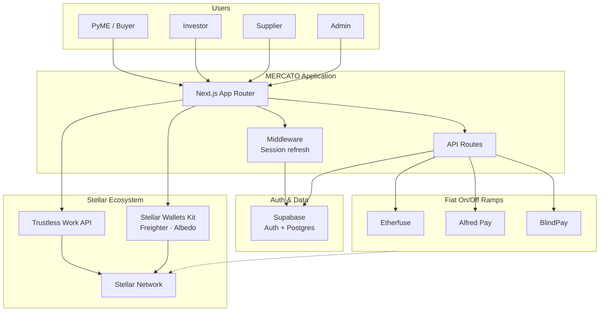
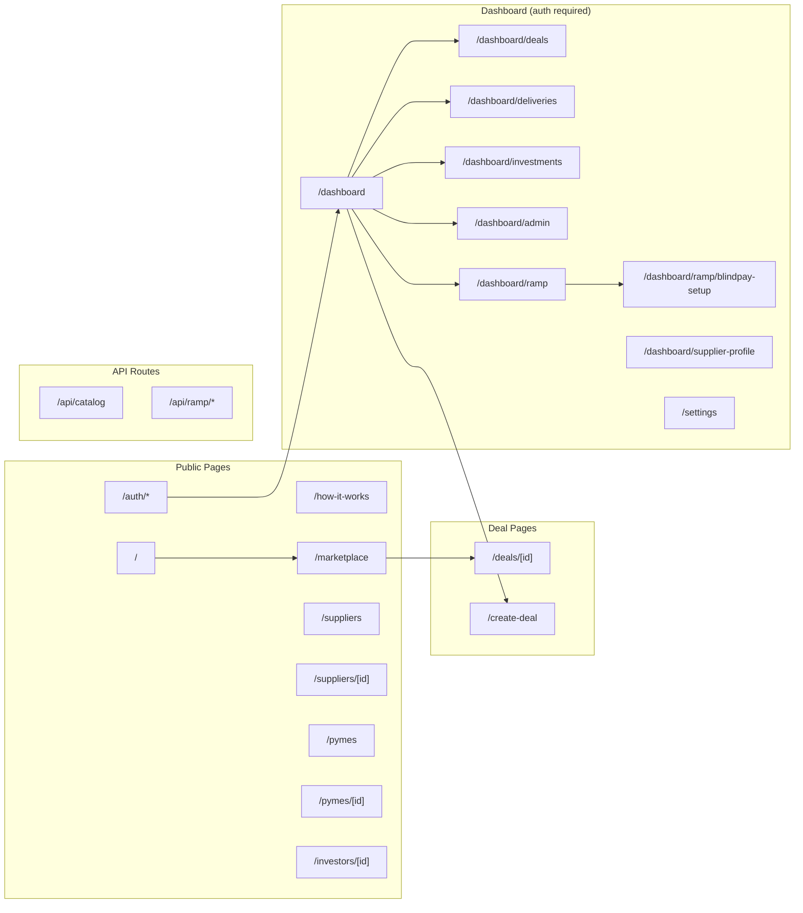
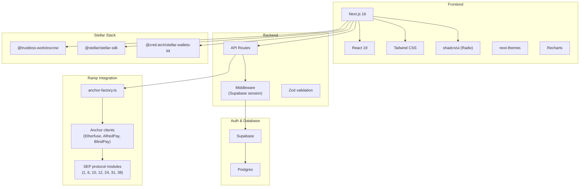
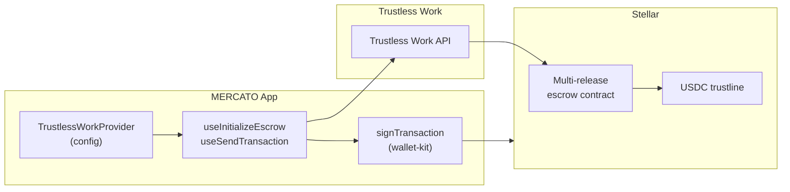
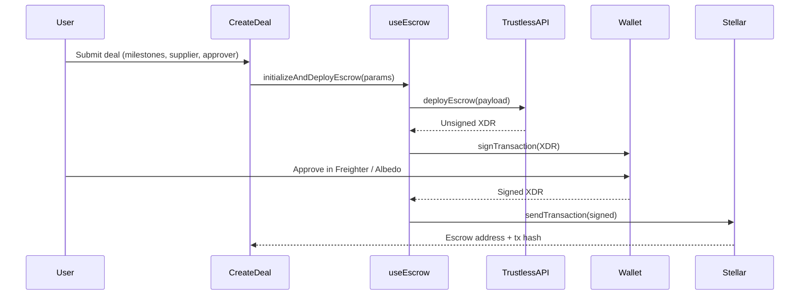
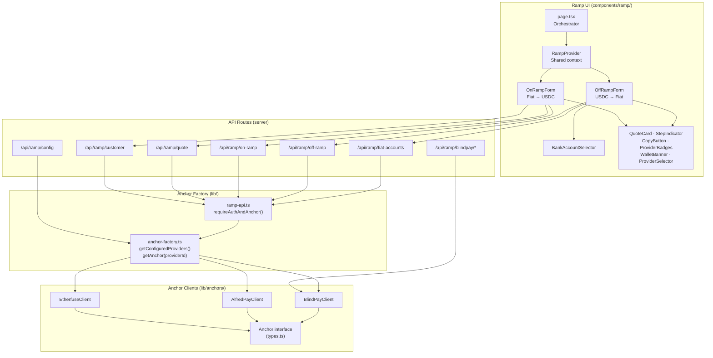
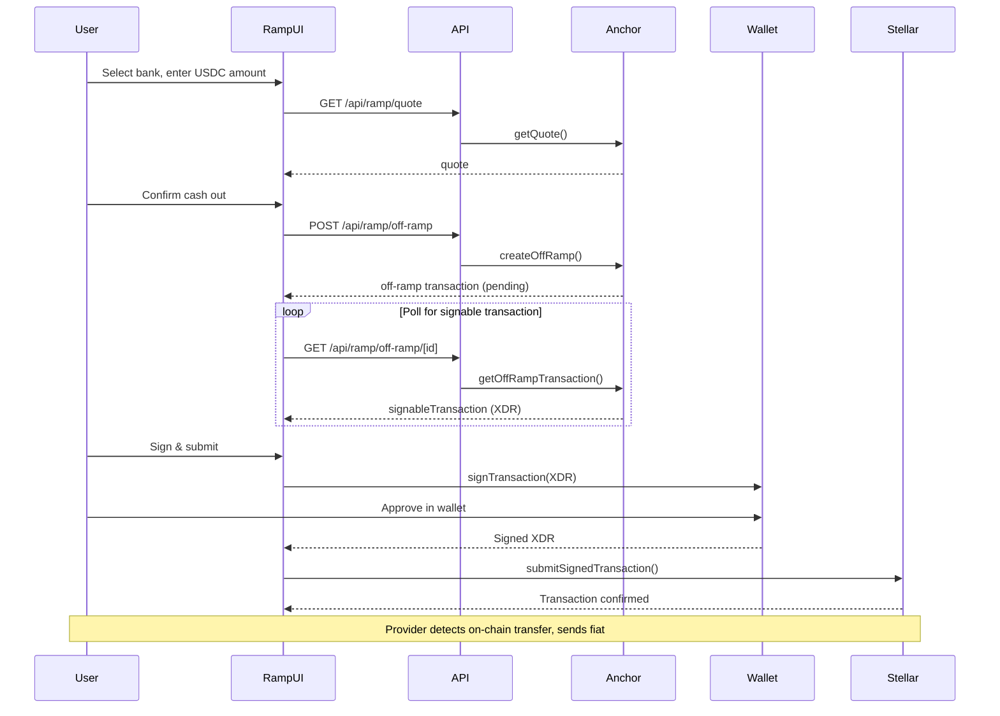
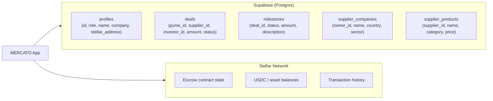
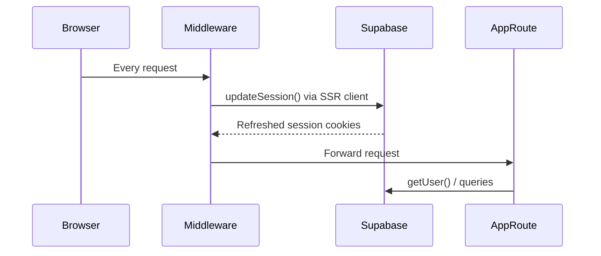
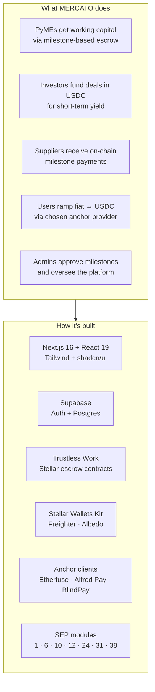

# MERCATO — Architecture Documentation

**Supply chain finance, transparently secured.**

This document describes the MERCATO application architecture: what it does, which tools and Stellar-based projects it uses, and how the pieces fit together. Diagrams use [Mermaid](https://mermaid.js.org/) and render in GitHub, GitLab, and most Markdown viewers.

---

## 1. High-Level System Overview



MERCATO is a web app that connects **PyMEs**, **investors**, and **suppliers** through blockchain-secured escrow. Auth and deal data live in **Supabase**; escrow and payments are **non-custodial** on **Stellar** via **Trustless Work**. Users move fiat to/from Stellar assets via configurable **ramp providers** (Etherfuse, AlfredPay, BlindPay). An **Admin** role oversees milestone approvals and platform operations.

---

## 2. What the Application Does

### 2.1 Core Deal Flow

```mermaid
sequenceDiagram
  participant PyME
  participant App
  participant Trustless
  participant Stellar
  participant Investor
  participant Supplier

  Note over PyME,Supplier: 1. PyME creates deal & deploys escrow
  PyME->>App: Create deal (product, supplier, milestones, terms)
  App->>Trustless: Initialize multi-release escrow
  Trustless->>Stellar: Deploy escrow contract
  PyME->>Stellar: Sign with wallet (Freighter / Albedo)
  Stellar-->>App: Escrow address

  Note over PyME,Supplier: 2. Investor funds the deal
  Investor->>App: Browse marketplace, select deal
  Investor->>Stellar: Fund escrow in USDC via wallet

  Note over PyME,Supplier: 3. Supplier delivers; milestones released
  Supplier->>App: Submit delivery proof
  PyME->>App: Approve milestone
  App->>Trustless: Request release
  Trustless->>Stellar: Release payment to supplier

  Note over PyME,Supplier: 4. PyME repays investors
  PyME->>Stellar: Repay principal + yield after term
```

### 2.2 User Roles

| Role | Main actions |
|------|-------------|
| **PyME (Buyer)** | Create deal, configure milestones, choose supplier from catalog, approve milestone releases, repay investors. Connects Stellar wallet for escrow deployment. |
| **Investor** | Browse marketplace, fund deals in USDC. Funds are locked in escrow until milestones are met and term completes. |
| **Supplier** | Manage company profile and product catalog, accept orders, submit delivery proof. Receives milestone payments to Stellar address. |
| **Admin** | View all platform deals, approve milestone releases on-chain, resolve disputes. Sees aggregate stats and pending approvals. |

### 2.3 Application Routes



**Full route inventory:**

| Route | Type | Description |
|-------|------|-------------|
| `/` | Public | Landing page (hero, stakeholders, trust, CTA) |
| `/how-it-works` | Public | Step-by-step flow explanation |
| `/marketplace` | Public | Browse and filter deals |
| `/create-deal` | Auth | Multi-step deal creation with escrow deployment |
| `/auth/login` | Public | Supabase email login |
| `/auth/sign-up` | Public | Registration with role selection |
| `/auth/sign-up-success` | Public | Post-signup confirmation |
| `/dashboard` | Auth | Role-based overview (stats, quick actions, recent deals) |
| `/dashboard/admin` | Admin | Milestone approvals, platform stats |
| `/dashboard/deals` | Auth | Supplier's deal list |
| `/dashboard/deliveries` | Auth | Supplier delivery management |
| `/dashboard/investments` | Auth | Investor portfolio view |
| `/dashboard/ramp` | Auth | Add funds / cash out (fiat ↔ USDC) |
| `/dashboard/ramp/blindpay-setup` | Auth | BlindPay onboarding wizard (ToS, KYC, wallet) |
| `/dashboard/supplier-profile` | Auth | Manage supplier companies and products |
| `/deals/[id]` | Public | Deal detail with milestones and escrow state |
| `/investors/[id]` | Public | Investor public profile |
| `/pymes` | Public | PyME directory |
| `/pymes/[id]` | Public | PyME public profile |
| `/suppliers` | Public | Supplier directory |
| `/suppliers/[id]` | Public | Supplier public profile |
| `/settings` | Auth | User profile and Stellar address |
| `/api/catalog` | API | Supplier product catalog |
| `/api/ramp/*` | API | Ramp provider proxy (14 routes) |

---

## 3. Tech Stack



| Layer | Technology | Version |
|-------|-----------|---------|
| **Framework** | Next.js (App Router, Turbopack) | 16.1 |
| **UI** | React, Tailwind CSS, shadcn/ui (Radix primitives), Recharts | React 19.2 |
| **Theming** | next-themes (light / dark) | 0.4 |
| **Auth & DB** | Supabase (Auth, Postgres, SSR client) | 2.47 |
| **Escrow** | Trustless Work API (@trustless-work/escrow) | 3.0 |
| **Wallets** | Stellar Wallets Kit (Freighter, Albedo) | 1.9 |
| **Stellar** | @stellar/stellar-sdk | 14.5 |
| **Validation** | Zod, react-hook-form | 3.24 / 7.54 |
| **Ramps** | Custom anchor clients + SEP modules (lib/anchors) | — |

---

## 4. Project Structure

```
mercato/
├── app/                          # Next.js App Router
│   ├── layout.tsx                # Root layout (providers, fonts, theme)
│   ├── page.tsx                  # Landing page
│   ├── auth/                     # Login, sign-up, sign-up-success
│   ├── create-deal/              # Multi-step deal creation
│   ├── dashboard/                # Authenticated dashboard
│   │   ├── page.tsx              # Role-based overview
│   │   ├── admin/                # Milestone approvals (admin only)
│   │   ├── deals/                # Supplier deal list
│   │   ├── deliveries/           # Delivery management
│   │   ├── investments/          # Investor portfolio
│   │   ├── ramp/                 # Fiat on/off ramp
│   │   │   ├── page.tsx          # Ramp orchestrator
│   │   │   └── blindpay-setup/   # BlindPay onboarding wizard
│   │   └── supplier-profile/     # Company & product management
│   ├── deals/[id]/               # Deal detail
│   ├── investors/[id]/           # Investor profile
│   ├── marketplace/              # Deal marketplace
│   ├── pymes/                    # PyME directory + [id] profile
│   ├── settings/                 # User settings
│   ├── suppliers/                # Supplier directory + [id] profile
│   └── api/                      # Server-side API routes
│       ├── catalog/              # Supplier product catalog
│       └── ramp/                 # Ramp provider proxy (14 routes)
│           ├── config/           # Available providers
│           ├── customer/         # Customer creation / lookup
│           ├── quote/            # Quote generation
│           ├── on-ramp/          # Fiat → crypto orders + [id] polling
│           ├── off-ramp/         # Crypto → fiat orders + [id] polling
│           ├── fiat-accounts/    # Bank account CRUD
│           ├── kyc-url/          # KYC redirect URL
│           ├── kyc-status/       # KYC status check
│           └── blindpay/         # BlindPay-specific (ToS, receiver, wallet, payout)
│
├── components/
│   ├── navigation.tsx            # Header nav bar
│   ├── navigation/               # NavLinks, WalletNav, UserNav
│   ├── deal-card.tsx             # Marketplace deal card
│   ├── theme-provider.tsx        # next-themes wrapper
│   ├── theme-toggle.tsx          # Light/dark toggle
│   ├── ramp/                     # Ramp UI (decomposed)
│   │   ├── ramp-provider.tsx     # Context provider (shared state)
│   │   ├── types.ts              # Ramp type definitions
│   │   ├── on-ramp-form.tsx      # On-ramp variant
│   │   ├── off-ramp-form.tsx     # Off-ramp variant
│   │   ├── bank-account-selector.tsx # Bank account CRUD
│   │   ├── provider-selector.tsx # Provider dropdown + badges
│   │   ├── wallet-banner.tsx     # Wallet connection prompt
│   │   ├── quote-card.tsx        # Quote breakdown display
│   │   ├── step-indicator.tsx    # Step progress circles
│   │   ├── copy-button.tsx       # Click-to-copy utility
│   │   └── provider-badges.tsx   # Provider capability pills
│   └── ui/                       # shadcn/ui primitives (~50 files)
│
├── lib/
│   ├── anchor-factory.ts         # Instantiates ramp providers from env vars
│   ├── ramp-api.ts               # Auth + anchor resolution for API routes
│   ├── stellar-submit.ts         # Submit signed XDR to Stellar
│   ├── deals.ts                  # Deal helper functions
│   ├── constants.ts              # Countries, sectors, provider IDs, statuses
│   ├── categories.ts             # Product categories
│   ├── format.ts                 # Currency / number formatting
│   ├── date-utils.ts             # Date formatting
│   ├── mock-data.ts              # Development mock data
│   ├── pyme-reputation.ts        # PyME reputation scoring
│   ├── types.ts                  # Shared TypeScript types
│   ├── utils.ts                  # cn() and general utilities
│   ├── anchors/                  # Ramp anchor library (portable)
│   │   ├── types.ts              # Anchor interface + shared types
│   │   ├── etherfuse/            # Etherfuse client (Mexico, SPEI)
│   │   ├── alfredpay/            # AlfredPay client (LATAM, SPEI)
│   │   ├── blindpay/             # BlindPay client (global)
│   │   ├── testanchor/           # Reference client for testanchor.stellar.org
│   │   └── sep/                  # SEP protocol modules (1, 6, 10, 12, 24, 31, 38)
│   ├── hooks/
│   │   └── useEscrowIntegration.ts  # Trustless Work escrow hooks
│   ├── supabase/
│   │   ├── client.ts             # Browser Supabase client
│   │   ├── server.ts             # Server-side Supabase client
│   │   ├── service.ts            # Service-role Supabase client
│   │   └── proxy.ts              # Session update for middleware
│   └── trustless/
│       ├── config.ts             # Trustless Work API config
│       ├── wallet-kit.ts         # Wallet signing helpers
│       ├── trustlines.ts         # USDC trustline setup
│       └── index.ts              # Re-exports
│
├── hooks/
│   ├── use-wallet.ts             # Stellar wallet connect / disconnect
│   ├── use-mobile.tsx            # Responsive breakpoint hook
│   └── use-toast.ts              # Toast notification hook
│
├── providers/
│   └── wallet-provider.tsx       # Global Stellar wallet context
│
├── middleware.ts                  # Supabase session refresh on each request
├── supabase/                     # Supabase migrations and config
└── scripts/                      # Build and deployment scripts
```

---

## 5. Stellar and Trustless Work (Escrow)

Escrow is **non-custodial**: funds sit in a Stellar smart contract; the platform never holds them. **Trustless Work** provides the contract logic and API; the PyME signs deployment with their Stellar wallet.

### 5.1 Trustless Work Integration



### 5.2 Escrow Configuration

| Env var | Purpose |
|---------|---------|
| `NEXT_PUBLIC_MERCATO_PLATFORM_ADDRESS` | Platform Stellar address — used as `releaseSigner`, `disputeResolver`, and `platformAddress` in escrow roles |
| `NEXT_PUBLIC_TRUSTLESSLINE_ADDRESS` | USDC trustline contract address for escrow payments |
| `NEXT_PUBLIC_TRUSTLESS_NETWORK` | `testnet` or `mainnet` |
| `NEXT_PUBLIC_TRUSTLESS_WORK_API_KEY` | Trustless Work API key |

### 5.3 Escrow Deploy Sequence



---

## 6. Ramp Providers (Fiat On/Off)

MERCATO supports **multiple ramp providers**. Users choose one in the UI; the app proxies all anchor calls through **API routes** so API keys stay server-side.

### 6.1 Architecture



### 6.2 Ramp Component Architecture

The ramp UI follows a **provider + variant** composition pattern:

| Component | Lines | Responsibility |
|-----------|-------|---------------|
| `ramp-provider.tsx` | ~280 | Context provider — shared state (`config`, `customer`, `action`), actions (`ensureCustomer`, `fetchQuote`), and meta (`walletInfo`, `isConnected`) |
| `on-ramp-form.tsx` | ~340 | On-ramp variant — amount entry, quote review, payment instructions display |
| `off-ramp-form.tsx` | ~370 | Off-ramp variant — quote, confirm, sign & submit transaction |
| `bank-account-selector.tsx` | ~210 | Bank account CRUD with collapsible add form |
| `page.tsx` | ~120 | Thin orchestrator — layout, tabs, Suspense boundary |

Shared presentational components: `QuoteCard`, `StepIndicator`, `CopyButton`, `ProviderBadges`, `ProviderSelector`, `WalletBanner`.

### 6.3 Provider Capabilities

| Provider | Region | Fiat rail | Stellar asset | KYC flow | Off-ramp signing |
|----------|--------|-----------|---------------|----------|-----------------|
| **Etherfuse** | Mexico | SPEI | USDC, CETES | Iframe | Deferred (poll for XDR, then sign) |
| **Alfred Pay** | Latin America | SPEI | USDC | Form | Standard |
| **BlindPay** | Global | Multiple | USDB | Redirect | Anchor payout submission |

Provider availability is driven by **environment variables**; `getConfiguredProviders()` in `anchor-factory.ts` returns only anchors with all required env vars set. All three clients implement the shared `Anchor` interface from `lib/anchors/types.ts`.

### 6.4 On-Ramp Data Flow

```mermaid
sequenceDiagram
  participant User
  participant RampUI
  participant API
  participant Anchor
  participant External

  User->>RampUI: Enter amount, request quote
  RampUI->>API: POST /api/ramp/customer
  API->>Anchor: createCustomer()
  Anchor->>External: Provider API
  External-->>API-->>RampUI: customer

  RampUI->>API: GET /api/ramp/quote
  API->>Anchor: getQuote()
  Anchor->>External: Quote API
  External-->>API-->>RampUI: quote (rate, fee, expiry)

  User->>RampUI: Confirm on-ramp
  RampUI->>API: POST /api/ramp/on-ramp
  API->>Anchor: createOnRamp()
  Anchor->>External: Create order
  External-->>API-->>RampUI: payment instructions (CLABE, reference)

  User->>External: Send fiat (e.g. SPEI transfer)
  External->>Stellar: Credit USDC to user wallet
```

### 6.5 Off-Ramp Data Flow (with deferred signing)



---

## 7. Data and Responsibility Split



| Store | Owns | Source of truth for |
|-------|------|-------------------|
| **Supabase** | Users, profiles, roles, deal metadata, milestones, supplier directory, products | Who created what, role assignments, milestone approval state, supplier catalog |
| **Stellar** | Escrow contracts, USDC balances, transaction history | Funds, on-chain escrow state, payment receipts |

The app reads both stores and reconciles: deal status in Supabase reflects the on-chain escrow state after milestone releases.

---

## 8. Authentication and Middleware



- **`middleware.ts`** runs on every request to keep the Supabase session alive (refreshes tokens via `lib/supabase/proxy.ts`).
- **Server components** use `lib/supabase/server.ts` (cookie-based SSR client).
- **API routes** use `requireAuth()` / `requireAuthAndAnchor()` from `lib/ramp-api.ts` for auth checks.
- **Client components** use `lib/supabase/client.ts` (browser client).

---

## 9. Environment Variables

| Variable | Scope | Description |
|----------|-------|-------------|
| `NEXT_PUBLIC_SUPABASE_URL` | Public | Supabase project URL |
| `NEXT_PUBLIC_SUPABASE_ANON_KEY` | Public | Supabase anon key |
| `NEXT_PUBLIC_TRUSTLESS_WORK_API_KEY` | Public | Trustless Work API key |
| `NEXT_PUBLIC_TRUSTLESS_NETWORK` | Public | `testnet` or `mainnet` |
| `NEXT_PUBLIC_MERCATO_PLATFORM_ADDRESS` | Public | Platform Stellar address (escrow roles) |
| `NEXT_PUBLIC_TRUSTLESSLINE_ADDRESS` | Public | USDC trustline contract address |
| `ETHERFUSE_API_KEY` | Server | Etherfuse API key |
| `ETHERFUSE_BASE_URL` | Server | Etherfuse API base URL |
| `ALFREDPAY_API_KEY` | Server | AlfredPay API key |
| `ALFREDPAY_API_SECRET` | Server | AlfredPay API secret |
| `ALFREDPAY_BASE_URL` | Server | AlfredPay API base URL |
| `BLINDPAY_API_KEY` | Server | BlindPay API key |
| `BLINDPAY_INSTANCE_ID` | Server | BlindPay instance ID |
| `BLINDPAY_BASE_URL` | Server | BlindPay API base URL |

Ramp providers are **opt-in**: only those with all required env vars appear in `/api/ramp/config`. Setting zero ramp env vars disables the ramp UI gracefully.

---

## 10. Summary



---

## References

- [Trustless Work](https://docs.trustlesswork.com/) — Escrow API and Stellar integration
- [Stellar](https://stellar.org) — Network and assets
- [Stellar Wallets Kit](https://stellarwalletskit.dev/) — Wallet connection (Freighter, Albedo)
- [Supabase](https://supabase.com) — Auth and database
- [lib/anchors/README.md](../lib/anchors/README.md) — Anchor interface and ramp provider details
